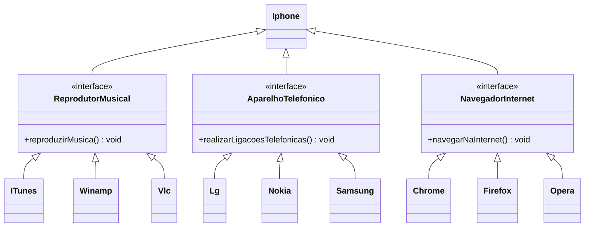

# Projeto Diagramação de Classes IPhone
Projeto desenvolvido para o Santander Dev Week fins aprimorar conhecimentos de polimorfismo e abstração.

# Diagrama de Classe

```mermaid
classDiagram
Iphone <|-- ReprodutorMusical
ReprodutorMusical: +reproduzirMusica() void
<<interface>> ReprodutorMusical
ReprodutorMusical <|-- ITunes
ReprodutorMusical <|-- Winamp
ReprodutorMusical <|-- Vlc

Iphone <|-- AparelhoTelefonico
AparelhoTelefonico: +realizarLigacoesTelefonicas() void
<<interface>> AparelhoTelefonico
AparelhoTelefonico <|-- Lg
AparelhoTelefonico <|-- Nokia
AparelhoTelefonico <|-- Samsung

Iphone <|-- NavegadorInternet
NavegadorInternet: +navegarNaInternet() void
<<interface>> NavegadorInternet
NavegadorInternet <|-- Chrome
NavegadorInternet <|-- Firefox
NavegadorInternet <|-- Opera
```